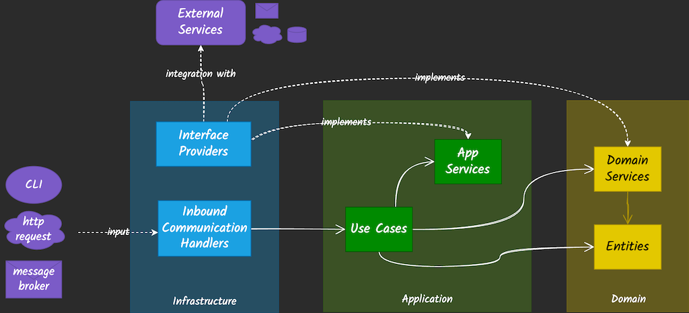

# Clean Architecture Go - Bridging Principles with Pragmatism

This repository contains the source code used as a demo during my Athens Gophers Meetup presentation 'Clean Architecture in Go: Bridging Principles with Pragmatism" on the 14th of March 2025.

You can also find the slides [here](./docs/slides/CleanArchitectureInGo_AthensGophers_14Mar2025.pdf) and some **examples** shared under `docs`

For a more in-depth article and extended example, check out my blog post: [Clean Architecture in Go](https://pkritiotis.io/clean-architecture-in-golang/).

## Application Overview

This sample web application implements a **Race tracking service**

### Requirements

#### Domain (Entities)
- `Runner`s 🏃‍♂️ participate in `Race`s 🏁
- Their race details are tracked in a race `Result📊`
  
#### Features (Use Cases)
- Register a `Runner` and send a notification on success
- Create a `Race`
- Log race `Result`s of a `Runner` for a specific `Race`
- Return race `Result`s for a `Runner`

## Developer's Handbook

### Code Design and repo structure

The code follows a clean architecture philosophy and uses the following 3-layer grouping:



These layers correspond to the following project structure:
- **domain/** – Enterprise/business logic and core models  
- **app/** – Application logic and use cases  
- **infra/** – Infrastructure: HTTP handlers, DBs, notifications, etc.
```
├── Makefile
├── cmd
│   └── main.go
├── docs
├── go.mod
├── go.sum
├── internal
│   ├── app
│   │   ├── bootstrap.go
│   │   ├── notification
│   │   │   ├── mock_notification.go
│   │   │   └── notification.go
│   │   ├── race
│   │   │   ├── service.go
│   │   │   └── service_test.go
│   │   └── runner
│   │       ├── service.go
│   │       └── service_test.go
│   ├── domain
│   │   ├── race
│   │   │   ├── race.go
│   │   │   ├── race_test.go
│   │   │   ├── repository.go
│   │   │   ├── result.go
│   │   │   └── result_test.go
│   │   └── runner
│   │       ├── email.go
│   │       ├── repository.go
│   │       ├── runner.go
│   │       └── runner_test.go
│   └── infra
│       ├── bootstrap.go
│       ├── http
│       │   ├── race
│       │   │   ├── handler.go
│       │   │   └── handler_test.go
│       │   ├── runner
│       │   │   ├── handler.go
│       │   │   └── handler_test.go
│       │   └── server.go
│       ├── notification
│       │   ├── console
│       │   │   ├── notificationservice.go
│       │   │   └── notificationservice_test.go
│       │   └── sendgrid
│       │       └── notificationservice.go
│       └── storage
│           ├── memory
│           │   ├── race
│           │   │   ├── repository.go
│           │   │   └── repository_test.go
│           │   └── runner
│           │       ├── repo.go
│           │       └── repo_test.go
│           └── mysql
│               └── runner
│                   ├── repo.go
│                   └── repo_test.go
```

- `cmd/main.go` is the executable
- `internal/` contains the code components splits on `domain`, `app`, `infra` based on their responsibility

### Makefile Operations

Use the makefile to run the corresponding commands
```
make run  ## Run the application on :8080
make lint  ## Perform linting
make test  ## Run unit tests
make build  ## Build the app executable for Linux
make fmt  ## Format the source code
```

### Architecture Linting
This repo uses [`go-arch-lint`](https://github.com/fe3dback/go-arch-lint) to enforce architectural boundaries.
- Config: See `.go-arch-lint.yml`
- Install: `go install github.com/fe3dback/go-arch-lint@latest`
- Run from project root: `go-arch-lint`